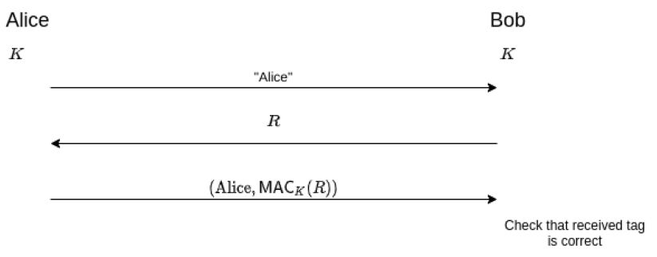

# Authentification
- Identification = annoncer qui on est
- Authentification = prouver qu'on est qui on prétend
## Authentification faible
- L'utilisateur exhibe un secret préalablement partagé avec le serveur
  - Mot de passe, cookie, ...
## Authentification forte

Pas vulnérable aux attaques par rejeu