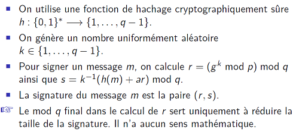
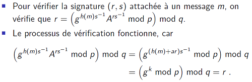
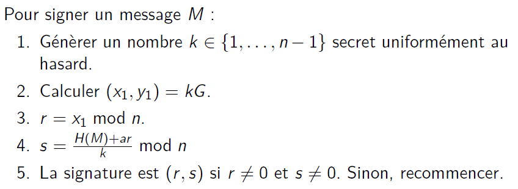
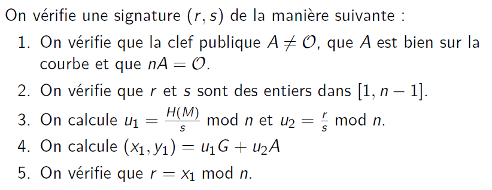
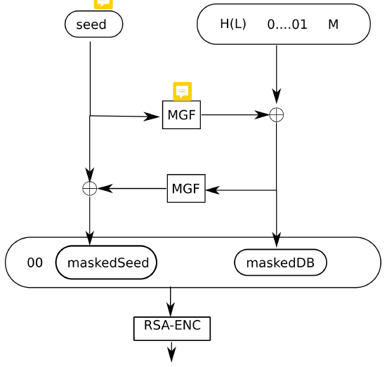

Crypto asymétrique
===

# Algorithmes
## Diffie-Hellman
### Principe général
#### Paramètres publics
- Groupe G où le logarithme discret est difficile
- g &#8712; G, d'ordre premier q
  - Le fait que q soit premier empêche certaines attaques
#### Algorithme
- Alice
  - Choisit un exposant a &in; &Zopf;q*
  - Envoie ya = ga
  - Secret partagé k = KDF(yba)
- Bob
  - Choisit un exposant b &#8712; &Zopf;q*
  - Envoie yb = gb
  - Secret partagé k = KDF(yab)
### G = groupe multiplicatif &Zopf;p* avec p premier
- Choisir deux nombres premiers p et q qui respectent p = cq + 1
  - Cette relation permet l'existence d'un élément d'ordre q, puisque comme ça l'ordre du groupe p-1 est un multiple de q
- Trouver g, un élément d'ordre q du groupe multiplicatif &Zopf;p* 
### Courbe elliptique
- Point G d'ordre n premier

## El Gamal
Chiffrement non déterministe
### Principe général
#### Paramètres publics
Comme pour Diffie-Hellman
#### Clés
- Clé privée
  - a &in; &Zopf;q
- Clé publique
  - A = ga
#### Chiffrement
- Tirer k &in; &Zopf;q uniformément au hasard
- (u, v) = (gk, M chiffré avec Ak)
#### Déchiffrement
M = v déchiffré avec ua

## Signatures DSA
### Principe général
#### Paramètres publics
- Groupe G où le logarithme discret est difficile
- g &in; G, d'ordre premier q
#### Clés
- Clé privée
  - a &in; &Zopf;q
- Clé publique
  - A = ga
#### Idée intuitive de la signature
- Choisir un exposant *k &in; &Zopf;q*
  - Choisi uniformément au hasard
  - Secret
- Fixer *r* déterminé par *gk &in; G*
  - *r* premier élément de la signature
- Soit l'exposant *b &in; &Zopf;q* déterminé par *M*, *a* et *r*
- Calculer *s &in; &Zopf;q* t. q. *gbs = gk*
  - *s* deuxième élément de la signature
  - *s* est l'exposant qui permet de "se déplacer" de *gb* à *gk*
  - Le fait que le point de départ dépende de *r* permet de prouver qu'on n'a pas choisi *gk* a posteriori
  - En calculant *s*, on donne la preuve qu'on connaît *a*
#### Idée intuitive de la vérification
- Calculer *gb* en utilisant *ga*, *M* et *r* qui sont connus
- Calculer *gbs*
  - Si la signature est valide, ça doit être égal à *gk* qui doit donner *r*
#### Modulo
- Tous les calculs d'exposants ont lieu modulo q
- C'est ok puisque q est l'ordre de g
### DSA
*s* est inversé

D'abord vérifier que r et s sont dans &Zopf;q

### ECDSA
*s* est inversé

## Chiffrement RSA
### Génération des clés
- Choisir des nombres premiers p et q, calculer n = pq
- Choisir un e premier avec phi(n) = (p-1)(q-1)
  - On choisit souvent e = 65537
    - Permet de chiffrer de manière efficace car e = 100...1
    - C'est un nombre premier donc il est inversible modulo phi(n) (sauf si il divise phi(n))
- Calculer d = l'inverse de e modulo phi(n)
- (n, e) est la clé publique, (n, d) est la clé privée
### Chiffrement / déchiffrement textbook RSA
- c = me mod n
- m = cd mod n
### RSA PKCS v1.5
- Inclut (facultatif) de l'aléatoire
- N'est pas IND-CPA
- Ne pas utiliser
### RSA-OAEP

IND-CCA secure contre les adversaires black box
### Problèmes/attaques
- Sur textbook RSA (donc sans formatage)
  - Comme la clé publique est connue et que RSA est déterministe, l'attaquant peut toujours faire une attaque à texte clair choisi
  - Si il y a un nombre trop faible de messages possibles, on peut retrouver le message par bruteforce
  - e trop petit
    - me < n, donc pas de modulo et c'est facile de calculer la racine nième de c.
    - Même si m est assez grand pour que le modulo ait lieu, si e est petit et réutilisé plusieurs fois pour le même message avec des n différents, on peut utiliser le CRT pour retrouver m
    - Si e est petit, on peut faire une attaque de Coppersmith
  - d trop petit
    - Wiener key recovery attack : si d < racine quatrième de n.
- Si un attaquant connaît phi(n)
  - Il peut retrouver d en calculant l'inverse de e mod phi(n)
  - Il peut retrouver p et q en résolvant n = pq, phi(n) = (p - 1)(q - 1)
## Signatures RSA
- Signature s = md mod n
- Vérification : m = se mod n et on vérifie que m = le message signé
### Signature rapide avec le CRT
- sp = md mod p-1 mod p
- sq = md mod q-1 mod q
- s = sp q-1 q + sq p-1 p mod n
- Beaucoup plus efficace parce que les exponentiations se font modulo la moitié de la taille de n
### Formatage
RSA-PSS
### Problèmes / attaques
- Les signatures textbook RSA (donc sans formatage) sont malléables
  - Pour un message et une signature (m, s), (mk, sk) est aussi une paire valide

# Problèmes difficiles sous-jacents
- Diffie-Hellman, El Gamal, DSA : logarithme discret dans &Zopf;p*
- ECDH, El Gamal courbes éliptiques, ECDSA : logarithme discret sur une courbe elliptique
- RSA : factorisation d'un nombre entier

# Tailles de clés
- RSA
  - taille de n : 2048 - 3072 bits
- DH, El Gamal, DSA
  - taille de p : 2048 - 3072 bits
  - taille de q, et donc des valeurs secrètes : 200 - 256 bits
- Elliptic curve
  - 256 bits