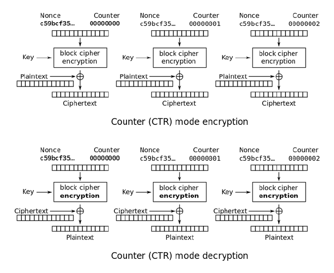
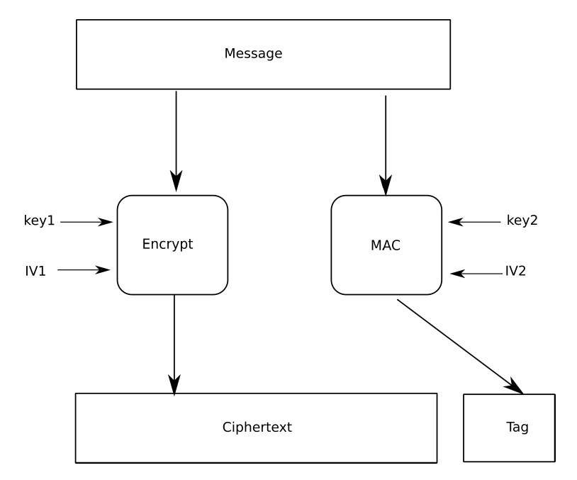

# Crypto symétrique
# Chiffrements linéaires (et affines)
## Description
La clé est (K, k), avec K une matrice inversible de taille n x n et k un vecteur de taille n. Les messages clairs et chiffrés m et c sont des vecteurs de taille n.

Chiffrement :  
c = Km + k (mod m)

Déchiffrement : 
m = K-1(c-k)
## Attaque contre le chiffre de Vigenère (K = 1)
À partir d'une paire (message claire m, message chiffré c) on calcule k = c - m

## Attaque contre le chiffrement linéaire (k = 0)
À partir de n paires (message claire, message chiffré) on peut poser :

KM = C

Où les colonnes de M sont les messages clairs et les colonnes de C sont les messages chiffrés.

On retrouve la clé en résolvant cette équation pour K (ce qui revient à calculer CM-1)

## Attaque contre le chiffrement affine dans le cas général (chiffre de Hill)
À partir de de n+1 paires (message claire m, message chiffré c) on peut poser :

KM = C

Où la ième colonne de M est mi - m0 et la ième colonne de C est ci - c0.

On retrouve K en résolvant cette équation pour K (ce qui revient à calculer CM-1). On retrouve k = c0 - Km0

# Masque jetable
c = m xor k
- La clé k est une chaîne de bits
  - au moins aussi longue que le message
  - tirée de manière uniformément aléatoire
  - jamais réutilisée
- Sous ces conditions, le chiffrement est parfaitement sûr
- C'est un chiffrement affine, mais l'attaque contre un chiffrement affine suppose que la clé soit réutilisée
## Attaques / problèmes
- Si la clé est réutilisée pour deux paires (m1, c1) et (m2, c2), l'adversaire peut récupérer m1 xor m2 = c1 xor c2
- Le message est facile à manipuler, inverser un bit du message chiffré ou de la clé inverse le bit correspondant du message déchiffré
- Il est difficile de générer une clé parfaitement aléatoire
- Transmettre des clés longues et nombreuses de manière sûre peut poser problème

# Blocs ciphers

- Déterministe (pas de nonce)
- Chiffre un nombre fixe de bits

## Chiffrement itéré

- On itère une fonction de ronde un certain nombre de fois
- K1, K2, ... sont appelés des sous-clés

## Algorithmes

| Primitive  | Sécurité | Taille de bloc  | Taille de clé            | Remarque                                                                                     |
|------------|----------|-----------------|--------------------------|----------------------------------------------------------------------------------------------|
| AES        | ok       | 128             | 128, 192, 256            | Le chiffrement et le déchiffrement sont assez différents                                     |
| Camellia   | ok       | 128             | 128, 192, 256            | Exotique Plus lent que AES Non US                                                      |
| Serpent    | ok       | 128             | 128, 192, 256            | Exotique Beaucoup plus lent que AES Possiblement marge de sécurité plus grande que AES |
| Triple-DES | legacy   | 64 (trop petit) | 168 mais sécurité de 112 | Très lent                                                                                    |
| Blowfish   | legacy   | 64 (trop petit) |                          |                                                                                              |
| DES        | nok      | 64 (trop petit) | 56 (trop petit)          |                                                                                              |
Legacy = ne pas utiliser dans du nouveau code, mais c'est acceptable de le laisser dans du code existant.

### Double- et Triple- DES
- À deux clés : chiffrer avec K1 -> déchiffrer avec K2 -> chiffrer avec K1
- À trois clés : chiffrer avec K1 -> déchiffrer avec K2 -> chiffrer avec K3
- Si on utilise à chaque fois la même clé, on obtient DES normal

# Stream ciphers
- Souvent plus efficace que le chiffrement par bloc
### Problèmes / attaques générales
- Résiste mal aux attaques contre l'intégrité : inverser un bit du cipher text inverse le bit correspondant du message déchiffré
- Si on réutilise un IV, XOR messages
## RC4
- Taille de clé : 40 à 2048 bits
- Pas d'IV, la clé ne doit jamais être réutilisée
- Les premiers 256 octets possèdent de nombreuses faiblesses statistiques exploitables
- Pas recommandé
## ChaCha20
- Taille de clé : 128 bits ou 256 bits
- Nonce de 64 bits (ou variante 96 bits)
  
  
- Une double ronde contient 8 "quarter-rounds", une pour chaque colonne et pour chaque diagonale
- Les 10 doubles rondes sont inversibles. Sans l'addition mot par mot finale, on pourrait retrouver l'état initial à partir de la sortie de 512 bits

# MAC
- Ne fournissent pas de non-répudiation
  - La clé est partagée, le MAC peut toujours avoir été généré par une autre personne.
## HMAC

- HMAC-SHA1 et HMAC-MD5 ne sont pas cassés parce que pouvoir générer des collisions ne permet pas de faire une attaque dessus

### Problèmes / attaques
- Il n'y a pas de taille de clé minimale dans le standard
  - Risque d'utiliser une clé trop petite
- Si on fait un seul hash et pas les deux, et que la fonction de hashage utilise Merkel-Damgard: 
  - À partir d'un message M et de son MAC on peut générer un MAC valide pour un autre message en "continuant" le Merkel-Damgard : 
  - M' = M || pad(M) || M2
  - MAC' = f(MAC, M2 || pad(M || pad(M) || M2))
    - Où f est la fonction de réduction
    - Il faut éventuellement découper en plusieurs blocs et appliquer plusieurs fois f
## CBC-MAC
On chiffre le message avec CBC et un IV de 0. Le MAC est la valeur du dernier bloc chiffré.
### Problèmes / attaques
À partir d'un message et de son MAC, on peut générer un autre message pour lequel le même MAC est valide :
- Pour un message faits des blocs m1, m2, m3, ... mn, on utilise m1, m2, m3, ..., mn, m1 xor MAC, m2, m3, ... mn.
  
- Solutions :
  - Avoir uniquement des messages de taille fixe
    - CBC-MAC de base
      - Ne pas utiliser
  - Ajouter la longueur du message comme premier bloc
  - Surchiffrer le résultat avec une seconde clé
    - EMAC
      - Sécurité ok
  - Le xorer avec quelque chose qui dépend de la clé
    - CMAC
      - Sécurité ok
## Poly1305
- Souvent utilisé avec Chacha
- Sécurité ok avec Chacha
- Sécurité legacy quand utilisé autrement
## Galois MAC
- Tag = c + MnH + Mn-1H2 + Mn-2H3 + ... + M1Hn
  - Où H est une valeur dérivée de la clé
  - et c est une valeur dérivée de la clé et d'un IV
  - et où les calculs sont faits dans GF(2128)
- Sécurité ok dans GCM
- Sécurité legacy quand utilisé autrement
### Problèmes / attaques
- Si l'attaquant connaît H, il peut modifier n'importe quel bloc et générer un tag valide.
  - Par exemple si il modifie Mn-2 en Mn-2', il obtient le nouveau tag en faisant tag' = tag + Mn-2H3 + Mn-2'H3
- Si on ne surchiffre pas avec c, l'attaquant peut retrouver H
  - Si le message fait un seul bloc, on a H = Tag / M
  - Sinon on peut poser Tag = MnH + Mn-1H2 + Mn-2H3 + ... + M1Hn et résoudre l'équation pour H
- Si on réutilise l'IV, l'attaquant peut retrouver H
  - Si le message fait un bloc, on a Tag1 XOR Tag2 = H M1 + H M2
    - H = (Tag1 + Tag2) (M1 + M2)-1
# Modes opératoires chiffrement
- Pour tous les modes opératoires (sauf ECB qu'il ne faut pas utiliser)
  - Limite du nombre de blocs dans un même message
    - CBC, CFB, OFB
      - Birthday problem sur la taille de bloc
    - CTR
      - 2c, avec c la taille du counter en bits
  - Limite du nombre de messages avant de changer de clé
    - Si IV/nonce déterministe
      - CBC
        - IV déterministe pas ok
      - CFB, OFB
        - 2b, avec b la taille de bloc en bits
      - CTR
        - 2n, avec n la taille de nonce en bits
    - Si IV/nonce aléatoire
      - CBC, CFB, OFB
        - Birthday problem sur la taille de bloc
      - CTF
        - Birthday problem sur la taille de nonce
## Electronic code book (ECB)

Ne pas utiliser.
### Problèmes / attaques
  - Déterministe
    - Deux blocs identiques sont chiffrés de manière identique => perte de confidentialité
  - Résiste très mal aux attaques contre l'intégrité : un attaquant peut dupliquer des blocs et changer leur ordre.

## Cipher block chaining (CBC)

- Chiffrement séquentiel, déchiffrement peut être parallélisé
### Problèmes / attaques
  - Réutilisation d'IV
    - L'attaquant sait si le début des deux messages est identique
  - IV prédictible
    - Si l'attaquant a accès à un oracle de chiffrement avec IV prédictible, il a en fait accès à un oracle de chiffrement avec IV choisi / blocs chiffrés précédents choisis
    - Pour obtenir le bloc c0 à partir de m0 et `IV choisi`
      - On donne à l'oracle m0 XOR `IV de l'oracle` XOR `IV choisi`
        - Le message donné par l'oracle au block cipher est m0 XOR `IV de l'oracle` XOR `IV choisi` XOR `IV de l'oracle` = m0 XOR `IV choisi`.
    - Pour obtenir le bloc ci à partir de mi et ci-1 choisi
      - On fait pareil, en remplaçant `IV choisi` par ci-1 choisi
  - Collision de blocs de ciphertext
    - Si on a deux blocs de ciphertext ci = cj
      - alors ci-1 XOR cj-1 = mi XOR mj
      - et comme pour la collision d'IV, l'attaquant sait si les blocs de message suivants sont identiques
  - Padding oracle attack
    - 
    - L'attaquant a accès à un oracle qui lui dit si le padding d'un message C est valide.
    - Pour déchiffrer un bloc ci :
      - On fait un bruteforce
        - byte par byte sur l'IV
        - avec à chaque fois uniquement le message chiffré ci
        - pour découvrir un IV qui, combiné avec ci, donne un padding valide qui fait la longueur du bloc
      - Alors mi = `IV découvert` XOR `padding pour un bloc entier` XOR ci-1
        - Le bloc sur lequel l'oracle vérifie qu'il y a un padding valide est BLOCK_DEC(ci) XOR IV
        - `IV découvert` XOR `padding pour un bloc entier` est ce qui est sorti du block cipher quand l'oracle a déchiffré ci pour nous, soit BLOCK_DEC(ci)
        - Il faut encore XOR avec ci-1 (ou avec l'IV original) pour finir de décrypter.
  - Attaque sur OpenSSH
    - 
    - Même idée que la padding oracle attack
    - OpenSSH
      - Encrypt and MAC
      - AES-CBC
      - Un seul long message, fait de plusieurs *packets*
      - Dans le premier bloc d'un nouveau packet
        - OpenSSH leak le fait que 14 bits précis valent 0 ou non
        - Si 4 bits précis supplémentaires valent 0 en même temps que les 14 premiers, OpenSSH leak les 32 premiers bits du bloc
    - Attaque pour décrypter une partie de ci
      - On envoie ci comme premier bloc d'un nouveau packet
      - Si les 14 bits valent 0
        - Alors les 14 bits de ci-1 XOR les 14 bits de ck = les 14 bits de mi
          - Avec ck le dernier bloc envoyé avant l'attaque
        - Probabilité 1 / 214 => environ 16'000 tentatives nécessaires
      - Si les 18 bits valent 0
        - Alors les 32 bits leakés XOR les 32 bits de ci-1 XOR les 32 bits de ck = les 32 bits de mi
        - Probabilité 1 / 218 => environ 260'000 tentatives nécessaires
## CFB

- Ne nécessite pas de padding
### Problèmes / attaques
- Réutilisation d'IV
  - m10 XOR m20 = c10 XOR c20
- Collision de blocs de ciphertext
  - Si on a deux blocs de ciphertext ci = cj
  - alors comme pour la collision d'IV, ci+1 XOR cj+1 = mi+1 XOR mj+1

## OFB

- Transforme un block cipher en stream cipher
- Ne nécessite pas de padding
### Problèmes / attaques
- Réutilisation d'IV
  - Les keystreams sont identiques => M1 XOR M2 = C1 XOR C2
- Collision de deux blocs de keystream
  - Cycle dans le keystream
  - xor de deux blocs chiffrés avec la même partie du cycle = xor des deux blocs clairs correspondants
- Résiste mal aux attaques contre l'intégrité : inverser un bit du cipher text inverse le bit correspondant du message déchiffré

## Counter mode (CTR)

- Transforme un block cipher en stream cipher
- Ne nécessite pas de padding

### Problèmes / attaques
- Réutilisation de nonce
  - Les keystreams sont identiques => M1 XOR M2 = C1 XOR C2
- Counter overflow
  - Cycle dans le keystream
  - xor de deux blocs chiffrés avec la même partie du cycle = xor des deux blocs clairs correspondants
- Résiste mal aux attaques contre l'intégrité : inverser un bit du cipher text inverse le bit correspondant du message déchiffré

## XTS
Pour le chiffrement de disque

Représente le chiffrement d'un secteur. i est le numéro de secteur et alpha est une constante.

- On xor avant et après le block cipher avec un *tweak*
- Le tweak est déterminé par la clé, le numéro de secteur et le numéro de bloc dans le secteur
- Si la taille de secteur n'est pas un multiple de la taille de bloc, on utilise du ciphertext stealing
### Problèmes / attaques
- Déterministe pour un emplacement de bloc et un numéro de secteur donné (voir généralités chiffrement)
- Intégrité mal protégée, l'attaquant peut remettre une ancienne valeur

# Modes opératoires chiffrement authentifié
## Constructions
### Encrypt-and-Mac

- Sécurité pas ok
- Oblige à déchiffrer avant de vérifier le MAC
  - Risque de leaker de l'information à un attaquant qui envoie de faux messages chiffrés
- Risque de mauvaise interaction entre le message chiffré et le MAC 
### Mac-then-Encrypt

- Sécurité pas ok
- Oblige à déchiffrer avant de vérifier le MAC
  - Risque de leaker de l'information à un attaquant qui envoie de faux messages chiffrés
### Encrypt-then-Mac

- Meilleure solution
- D'abord vérifier le tag, ensuite seulement déchiffrer si tag correct
## Algorithmes
### CCM

- CTR génère un keystream
- Le message est chiffré avec les blocs 1, 2, ... du keystream
- MAC 
  - Généré sur le message clair et le nonce
  - Fait avec CBC-MAC
  - Surchiffré avec le bloc 0 du keystream
### GCM

- CTR génère un keystream
  - Nonce 96 bits
  - => counter 32 bits si bloc 128 bits
- Le message est chiffré avec les blocs 2, 3, ... du keystream
- MAC
  - Généré sur le message chiffré, n'utilise pas le nonce
  - Fait avec Galois MAC, où H est obtenu en chiffrant un bloc de zéros
  - Surchiffré avec le bloc 1 du keystream
#### Problèmes / attaques
Problèmes de CTR et de galois MAC
# Modes opératoires recommandations

# Taille de clés pour le chiffrement symétrique
S'applique au chiffrement et aux MACs
- 128 - 256 bits.
- 80 bits est insuffisant.
- Pour une clé de taille l, l'attaquant doit essayer 2l - 1 clés en moyenne, 2l clés au pire.
# Fonctions de hachage
## Définition fonction de hachage cryptographiquement sûre
- À partir d'un message m de taille arbitraire, génère une empreinte h de taille constante l
- Le calcul d'une empreinte est rapide
- Résiste aux trois points suivants 
### Résistance à la première préimage
- À partir de h, il est impossible de trouver m tel que h = H(m)
- Coût d'une attaque (bruteforce) : O(2l)
### Résistance à la seconde préimage
- À partir de m et h = H(m), il est impossible de trouver m' différent de m tel que h = H(m')
- Coût d'une attaque (bruteforce) : O(2l)
### Résistance aux collisions
- Il est impossible de trouver m, m' différents tels que H(m) = H(m')
- Coût d'une attaque : O(2l/2)
  - On calcule le hash de messages aléatoires et on les stocke dans une hashtable
## Constructions
- Il peut être facile de trouver des préimages ou des collisions si le padding est mal géré
### Merkle-Damgard

f est une fonction de compression.

La construction de Davies-Meyer peut être utilisée comme fonction de compression :

#### Problèmes / attaques
- Length extensoin attack
  - À partir d'un hash h = H(M) et sans connaître M,
  - un attaquant peut calculer H(M|P) pour un P arbitraire.

### Éponge

- f est la Keccak-f Internal Permutation function
- Facile à inverser

## Algos fonctions de hachage

| Algo               | Sécurité             | Construction                  | Taille de sortie                               | Remarque                                                                                               |
|--------------------|----------------------|-------------------------------|------------------------------------------------|--------------------------------------------------------------------------------------------------------|
| SHA-3              | 224 legacy, reste ok | Eponge                        | 224, 256, 384, 512                             |                                                                                                        |
| SHA-3 SHAKE128/256 | ok                   | Eponge                        | Arbitraire                                     |                                                                                                        |
| SHA-2              | 224 legacy, reste ok | Merkle-Damgard + Davies-Meyer | 224, 256, 384, 512                             | Deux algos de base : 256 et 512. Il existe deux façons d'obtenir 224 et deux façons d'obtenir 384. |
| Whirlpool          | ok                   |                               | 512                                            |                                                                                                        |
| Blake 1 ou 2       | ok                   |                               | 224, 256, 384, 512                             |                                                                                                        |
| RIPEMD-160         | legacy               |                               | 160                                            |                                                                                                        |
| MD5                | nok                  | Merkle-Damgard                | 128                                            | On trouve rapidement des collisions                                                                    |
| SHA1               | nok                  | Merkle-Damgard                | 160                                            | On trouve rapidement des collisions **avec préfix choisi**                                             |

- Quand on parle de SHA-256 ou SHA-512, cela sous-entend SHA-2
### Chosen-prefix collision attack sur SHA-1
Shambles attack
  - Deux messages différents ayant le même hash
    - Début identique, choisi par l'attaquant
    - Partie 2 différentes, choisie par l'attaquant pour chaque message
    - Partie 3 non choisie par l'attaquant
    - Éventuellement partie 4 identique, choisie par l'attaquant
  - Permet par exemple de faire signer un message innocent, et d'obtenir une signature valable pour un message malicieux.

### MD5
- Cassé, il est possible de trouver rapidement des collisions
- Merkle-Damgard
- Empreintes de 128 bits
### SHA-1
- Cassé, il est possible de trouver rapidement des collisions
- Merkle-Damgard
- Empreintes de 160 bits
### SHA-256, SHA-512 (SHA-2)
- Sûr
- Merkle-Damgard + Davies-Meyer
- Empreintes de 224, 256, 384, 512 bits
### SHA-3
- Sûr
- Construction éponge
- Empreintes de 224, 256, 384, 512 bits
# Padding
- Permet de faire en sorte que la taille du message soit un multiple de la taille de bloc
- Utilisé par les fonctions de hachage et certains modes opératoires
- Pour tous les M1, M2 différents, on doit avoir M1|padding différent de M2|padding
- Il faut toujours ajouter un padding, même si la taille de M est déjà un multiple de la taille de bloc
## Algos padding
### Bit padding
10*
### Merkle-Damgard padding
10*L
- Où L est la taille du message encodée sur 64 bits
### Byte padding ANSI X9.23
- Le dernier byte est la taille du padding
- Le reste est données arbitraires
### Byte padding PKCS#7
- Chaque byte du padding a la valeur k
- k est le nombre de bytes du padding
## Ciphertext-Stealing
Alternative au padding qui permet de ne pas augmenter la taille du texte chiffré

- On utilise comme padding la fin de l'avant dernier bloc chiffré, appelée tail
- Comme ça on n'a pas besoin d'inclure tail dans le texte chiffré