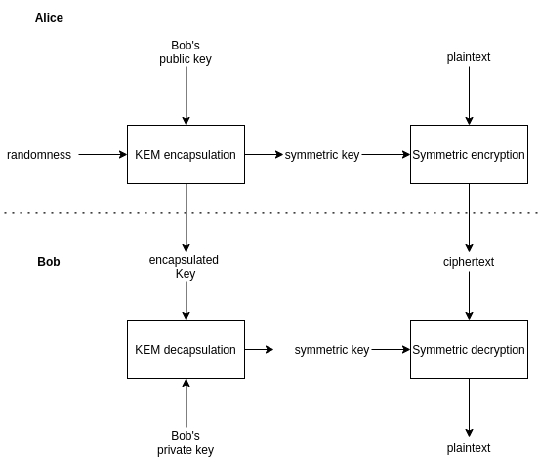

# Généralités chiffrement
## Permutations
- Un algorithme de chiffrement est une famille de permutations
    - Permutation <=> on peut inverser l'algorithme
    - La clé détermine une permutation précise
    - Sur {0, 1}n il existe 2n! permutations
## Chiffrement parfaitement sûr
Un chiffrement est appelé parfaitement sûr si le texte clair X et le texte chiffré Y sont statistiquement indépendants.
- <=> Pr[X|Y] = Pr[X]
- La connaissance du texte chiffré n'apporte aucune connaissance sur le texte clair
## Nonce et chiffrement déterministe
- Le fait que le chiffrement soit déterministe entraîne une fuite d'information
    - Vu qu'on peut savoir quand deux messages identiques sont envoyés
- Une manière de résoudre ce problème est que l'algorithme utilise un nonce ou un IV, différent pour chaque message
## Modèles de sécurité
### Attaques
- Attaque à texte chiffré : l'adversaire connaît un ou plusieurs textes chiffrés
- Attaque à texte clair connu : l'adversaire connaît une ou plusieurs paires (texte clair, texte chiffré)
- Attaque à texte clair choisi : l'adversaire a accès à un oracle de chiffrement
- Attaque à texte chiffré choisi : l'adversaire a accès à un oracle de déchiffrement
- Attaque à texte clair et chiffré choisi : combinaison des deux précédentes
### Oracle
Les attaques où l'adversaire a accès à un oracle sont soit :
- Adaptatives : l'adversaire peut attendre la réponse de l'oracle avant de faire une nouvelle requête
- Non-adaptative : l'adversaire doit effectuer toutes ses requêtes d'un coup
## Tailles de clés
La taille de la clé dépend de pendant combien de temps on veut protéger les données
- Clé symétrique : il faut prendre en compte la complexité du bruteforce et la loi de Moore.
- Clé asymétrique : en plus de la loi de Moore, il faut prendre en compte les meilleurs algorithmes connus pour casser le problème difficile sous-jacent
## Chiffrement hybride
- Dans la pratique, comme le chiffrement asymétrique est beaucoup trop peu efficace, on l'utilise uniquement pour échanger des clés symétriques 

