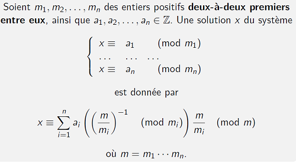
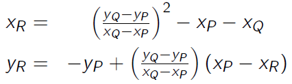
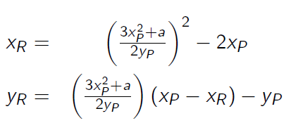

# Maths crypto
## Définitions groupe, anneau, corps
### Groupe
Ensemble muni d'une opération (associative) où
- L'opération est une une loi de composition interne (l'appliquer sur deux éléments du groupe donne toujours un élément du groupe)
- Il existe un élément neutre (l'opération entre un élément a et l'élément neutre donne toujours a)
- Chaque élément possède un élément symétrique dans le groupe
  - Pour un groupe additif, l'élément symétrique de a est appelé opposé et il est noté -a
  - Pour un groupe multiplicatif, l'élément symétrique de a est appelé inverse et il est noté a<sup>-1</sup>
### Anneau
Ensemble muni de deux opérations appelées addition et multiplication où
- La multiplication est distributive à gauche et à droite par rapport à l'addition
- L'ensemble avec l'addition seule est un groupe (commutatif)
- L'ensemble avec la multiplication seule est "presque" un groupe (loi interne et élément neutre, mais pas besoin qu'il y ait des inverses)

### Corps
Anneau où l'ensemble privé de 0 muni de la multiplication est un groupe.
- Tous les corps possèdent p<sup>m</sup> éléments pour un nombre premier p et un nombre entier m &geq; 2. Pour chaque p, m il existe un unique corps d'ordre p<sup>m</sup>.
  - p est appelé caractéristique du corps.
- GF(p<sup>m</sup>) désigne le corps à p<sup>m</sup> éléments.

## Puissances d'un élément d'un groupe, ordre
Pour un élément a d'un groupe (fini) G :
- L'opération qui consiste à prendre l'élément neutre et à lui appliquer l'opération avec un élément a i fois (element_neutre * a * a * ... * a) est notée a<sup>i</sup>
  - a<sup>0</sup> donne l'élément neutre
  - i n'est pas un élément de G, c'est juste un entier. On ne peut pas lui appliquer les règles de calcul qu'on utilise dans G.
- Les puissances successives de a forment un cycle
  - ord(a) est le plus petit i > 0 tel que a<sup>i</sup> donne l'élément neutre
  - Donc c'est la taille du cycle
  - Théorème de Lagrange : ord(a) divise |G|
- a est un générateur <=> ord(a) = |G|
    - Le cycle des puissances successives d'un générateur passe par tous les éléments du groupe
    - Un groupe qui possède un générateur est appelé un groupe cyclique
- On peut travailler dans l'exposant comme dans &Zopf;<sub>ord(a)</sub>
    - Donc a<sup>i</sup> = a<sup>i + k ord(a)</sup>, pour n'importe quel entier relatif k
    - a<sup>-1</sup> = a<sup>ord(a) - 1</sup> est l'élément symétrique de a
- On peut aussi travailler dans l'exposant comme dans &Zopf;<sub>|G|</sub> (puisque selon le théorème de Lagrange |G| est un multiple de ord(a))
  - Donc a<sup>i</sup> = a<sup>i + k |G|</sup> (théorème de Fermat-Euler), pour n'importe quel entier relatif k

## Groupes, anneaux et corps utilisés en crypto

|                            | Anneau &Zopf;                                                                                                                                                                                                                                                                                                                                                                                                                                                                                             |                                               | Anneau &Zopf;<sub>p</sub>[x] où p est premier                                                                                                                                                                                                                                                                                                                                                                                                                                                                             |
|----------------------------|-----------------------------------------------------------------------------------------------------------------------------------------------------------------------------------------------------------------------------------------------------------------------------------------------------------------------------------------------------------------------------------------------------------------------------------------------------------------------------------------------------------|-----------------------------------------------|---------------------------------------------------------------------------------------------------------------------------------------------------------------------------------------------------------------------------------------------------------------------------------------------------------------------------------------------------------------------------------------------------------------------------------------------------------------------------------------------------------------------------|
| Éléments                   | &Zopf;                                                                                                                                                                                                                                                                                                                                                                                                                                                                                                    |                                               | Les polynômes ayant leurs coefficients dans &Zopf;<sub>p</sub>                                                                                                                                                                                                                                                                                                                                                                                                                                                            |
| Nombre d'éléments          | Infini                                                                                                                                                                                                                                                                                                                                                                                                                                                                                                    |                                               | Infini                                                                                                                                                                                                                                                                                                                                                                                                                                                                                                                    |
|                            | 1 divise tous les nombres                                                                                                                                                                                                                                                                                                                                                                                                                                                                                 |                                               | les polynômes constants divisent tous les polynômes                                                                                                                                                                                                                                                                                                                                                                                                                                                                       |
| Nombre premier p           | Non égal à 1<br/>Divisible uniquement par : <br/>- 1<br/>- p                                                                                                                                                                                                                                                                                                                                                                                                                                              | Polynôme irréductible p(x)                    | Non constant<br/>Divisible uniquement par:<br/>- les polynômes constants<br/>- &alpha;p(x), pour tous les &alpha; &in; &Zopf;<sub>p</sub>                                                                                                                                                                                                                                                                                                                                                                                 |
| Crible d'Eratosthène       | Trouve les nombres premiers < n : <br/> Barrer tous les multiples du plus petit entier non barré, s'arrêter à racine de n. <br/>Problème : coût en calcul et en mémoire                                                                                                                                                                                                                                                                                                                                   | Déterminer si un polynôme est irréductible    | <ul><li>Degré 0 : jamais irréductible</li><li>Degré 1 : toujours irréductible</li><li>Degré 2 ou 3 : racine <=> pas irréductible</li><li>Degré > 3 :<br/>racine => pas irréductible<br/>tester de diviser par tous les polynômes irréductibles de degré &le; degré/2</li></ul>                                                                                                                                                                                                                                            |
| Nombres premiers < 100     | 2, 3, 5, 7, 11, 13, 17, 19, 23, 29, 31, 37, 41, 43, 47, 53, 59, 61, 67, 71, 73, 79, 83, 89, 97                                                                                                                                                                                                                                                                                                                                                                                                            | Exemples de polynômes unitaires irréductibles | <ul><li>Dans &Zopf;<sub>2</sub>[x] (liste complète pour les degrés 2,3,4) :<br/>x<sup>2</sup>+x+1,<br/>x<sup>3</sup>+x<sup>2</sup>+1, x<sup>3</sup>+x+1<br/>x<sup>4</sup>+x<sup>3</sup>+x<sup>2</sup>+x+1, x<sup>4</sup>+x<sup>3</sup>+1, x<sup>4</sup>+x+1<br/>x<sup>5</sup>+x<sup>2</sup>+1</li><li>Dans &Zopf;<sub>3</sub>[x] :<br/>x<sup>2</sup>+1, x<sup>2</sup>+2x+2</li><li>Dans &Zopf;<sub>5</sub>[x] :<br/>x<sup>2</sup>+2, x<sup>2</sup>+x+1</li><li>Dans &Zopf;<sub>7</sub>[x] :<br/>x<sup>2</sup>+2</li></ul> |
| Factorisation unique       | Tout nombre naturel &ge; 2 est le produit unique de nombres premiers.<br/><br/> On ne connaît pas d'algorithme efficace pour trouver cette factorisation.                                                                                                                                                                                                                                                                                                                                                 |                                               | Tout polynôme a(x) &in; &Zopf;<sub>p</sub>[x] non nul est le produit unique de polynômes unitaires irréductibles et d'un entier.<br/><br/>Il existe des algorithmes efficaces pour trouver cette factorisation.                                                                                                                                                                                                                                                                                                           |
| Nombre de nombres premiers | <ul><li>Il existe une infinité de nombres premier</li><li>Nombre de nombres premiers &le; n : &pi;(n) &thickapprox; n / ln(n)</li><li>Probabilité de tomber sur un nombre premier si on choisit entre 0 et n : environ 1 / ln(n)</li><li>Probabilité de tomber sur un nombre premier si on choisit un nombre à n bits : environ 1 / (n ln(2))</li></ul>                                                                                                                                                   |||
| PGCD                       | Plus grand diviseur commun<br/><br/>On le trouve avec l'algorithme d'Euclide.<br/><br/>Pour a > b :<br/>pgcd(a, b) = pgcd(b, (pgcd(a, b))                                                                                                                                                                                                                                                                                                                                                                 |                                               | PGDC de a(x) et b(x) :<br/>Unique polynôme **unitaire** de degré maximal qui divise a(x) et b(x)<br/><br/>On le trouve avec l'algorithme d'Euclide. Si le résultat n'est pas un polynôme unitaire, il faut le diviser par le facteur du plus haut degré pour obtenir un polynôme unitaire.<br/><br/>Pour degré de a(x) > degré de b(x) :<br/>pgcd(a(x), b(x)) = pgcd(b(x), (pgcd(a(x), b(x)))                                                                                                                             |
| Nombres premiers entre eux | a est premier avec b<br/><=> pgdc(a, b) = 1<br/><=> a est inversible modulo b, càd il existe a<sup>-1</sup> tel que a<sup>-1</sup>a &Congruent; 1 (mod b)<br/><=> les décompositions en facteurs premiers de a et b n'ont aucun facteur commun<ul><li>Deux nombres premiers (différents) sont toujours premiers entre eux</li><li>Un nombre premier p est premier avec tous les nombres < p</li><li>Les seuls nombres qui ne sont pas premiers avec un nombre premier p sont les multiples de p</li></ul> |                                               | pgdc(a(x), b(x)) = 1<br/><=> a(x) est inversible modulo b(x)<br/><=> les décompositions en polynômes unitaires irréductibles de a(x) et b(x) n'ont aucun polynôme en commun                                                                                                                                                                                                                                                                                                                                               |
| Identité de Bézout         | Pour d = pgdc(a, b), l'identité de Bézout est l'équation :<br/>ax + by = d<br/><br/>Si d = 1, y est l'inverse de b modulo a.<br/><br/>On trouve x et y avec l'algorithme d'Euclide étendu                                                                                                                                                                                                                                                                                                                 |                                               | Idem.                                                                                                                                                                                                                                                                                                                                                                                                                                                                                                                     |
| Lemme d'Euclide            | Si un nombre premier p divise rs, alors p est un des facteurs premiers de r ou de s                                                                                                                                                                                                                                                                                                                                                                                                                       |

|                             | Anneau &Zopf;<sub>m</sub>                                                                                                                                                                                                                                                                                                                                                                                                                                                                                                 |
|-----------------------------|---------------------------------------------------------------------------------------------------------------------------------------------------------------------------------------------------------------------------------------------------------------------------------------------------------------------------------------------------------------------------------------------------------------------------------------------------------------------------------------------------------------------------|
| Éléments                    | Les entiers de 0 à m-1                                                                                                                                                                                                                                                                                                                                                                                                                                                                                                    |
| Ordre                       | m                                                                                                                                                                                                                                                                                                                                                                                                                                                                                                                         |

|          | Groupe multiplicatif &Zopf;<sub>m</sub><sup>*</sup> |
|----------|-----------------------------------------------------|
| Éléments | Entiers de 1 à m premiers avec m                    |
| Ordre    | &phi;(m)                                            |

|                                    | Corps &Zopf;<sub>p</sub> où p est premier                                                                               | Corps &Zopf;<sub>p</sub>[x]/(m(x)) où p est premier et m(x) est irréductible                                                             |
|------------------------------------|-------------------------------------------------------------------------------------------------------------------------|------------------------------------------------------------------------------------------------------------------------------------------|
| Éléments                           | Les entiers de 0 à p-1                                                                                                  | Les polynômes de degré < deg(m(x)) et ayant leurs coefficients dans &Zopf;<sub>p</sub>                                                   |
| Ordre                              | p                                                                                                                       | p<sup>deg(m(x))</sup>                                                                                                                    |
| Groupe multiplicatif correspondant | &Zopf;<sub>p</sub><sup>* </sup><br/><br/>Tous les éléments sauf 0<br/><br/>L'ordre de &Zopf;<sub>p</sub><sup>*</sup><br/> est p-1 | (&Zopf;<sub>p</sub>[x]/(m(x)))* <br/><br/>Tous les éléments sauf 0<br/><br/>L'ordre de (&Zopf;<sub>p</sub>[x]/(m(x)))* est p<sup>deg(m(x))</sup>-1 |

## &phi;(n)
Pour p premier:
- &phi;(p) = p - 1
- &phi;(p<sup>k</sup>) = (p - 1)p<sup>k-1</sup>

Pour m et n premiers entre eux:
- &phi;(mn) = &phi;(m)&phi;(n)

Algo général pour &phi;(n) :
```
resultat = n
pour chaque facteur premier p de n :
    resultat *= (p-1) / p
```

## Propriétés pour les calculs dans &Zopf;<sub>m</sub>
- Dans un calcul fait de nombres additionnés et / ou multipliés, on peut remplacer n'importe quel nombre a par a +km où k est n'importe quel entier relatif.
  - Par contre cette règle ne fonctionne pas avec les exposants (puisque l'exposant n'est pas un élément du groupe).
  - Il peut être utile de se rendre compte qu'un nombre est égal à un petit nombre négatif, comme -1 ou -2.
- Diviser par a est équivalent à  multiplier par l'inverse de a
- Seulement si a est premier avec m :
  - a<sup>i</sup> = a<sup>i + k o</sup> pour n'importe quel entier relatif k, où o est l'ordre de a dans &Zopf;<sub>m</sub><sup>* </sup>
  - a<sup>i</sup> = a<sup>i + k &phi;(m)</sup> pour n'importe quel entier relatif k

## Théorème des restes chinois

### Isomorphisme d'anneau entre &Zopf;<sub>mn</sub> et &Zopf;<sub>m</sub> x &Zopf;<sub>n</sub>
Uniquement si m et n sont premiers entre eux.
- Passage de &Zopf;<sub>mn</sub> à &Zopf;<sub>m</sub> x &Zopf;<sub>n</sub> (CRT<sup>-1</sup>) : x -> (x mod m, x mod n)
- Passage de &Zopf;<sub>m</sub> x &Zopf;<sub>n</sub> à &Zopf;<sub>mn</sub> (CRT) : (a, b) -> a n<sup>-1</sup>n + b m<sup>-1</sup>m mod mn
  - Où n<sup>-1</sup> est l'inverse de n modulo m, et idem dans l'autre sens pour m<sup>-1</sup> 

## Racines carrées
### Dans &Zopf;<sub>p</sub> avec p premier et > 2
- 0 a une seule racine carrée : 0
- 1 a deux racines carrées : 1 et -1
- Les autres éléments ont soit aucune soit deux racines carrées, qui sont leurs opposés additifs.
### Dans &Zopf;*<sub>pq</sub> avec p et q premiers, différents et > 2
- 0 a une seule racine carrée : 0
- Les autres éléments ont soit 0 soit 4 racines carrées
  - Les 4 racines sont deux paires d'éléments opposés additivement.
  - Si (a, b) est le tuple correspondant dans &Zopf;<sub>p</sub> x &Zopf;<sub>q</sub>, alors a et b ont chacun soit 0 soit deux racines dans &Zopf;<sub>p</sub> et &Zopf;<sub>q</sub> respectivement. 

## Tests pour déterminer si un nombre est premier
On veut tester si n est premier
### Test de Fermat
- Si a<sup>n-1</sup> mod n &ne; 1, alors n n'est pas premier.
  - a est choisi aléatoirement dans &Zopf;<sub>n</sub> - 0
- Les nombres de Carmichael ne sont pas premiers mais passent presque toujours ce test.
### Test de Miller-Rabin
#### Idée
Dans &Zopf;<sub>n</sub>, pour n'importe quel élément a :
- Si a<sup>n-1</sup> &ne; 1, n n'est pas premier (test de Fermat)
- Si 1 possède une racine non triviale (différente de 1 et -1), n n'est pas premier

Soit d le nombre impair tel que n - 1 = 2<sup>s</sup> d. On part de x := a<sup>d</sup> et on s'intéresse à la chaîne des nombres obtenus en élevant x au carré plusieurs fois jusqu'à arriver à a<sup>n-1</sup>. Si n est premier :
- Soit le premier élément de la chaîne est 1 et tous les suivants aussi
- Soit, après un nombre indéterminé d'étapes, la chaîne atteint -1 et tous les éléments suivants sont 1
#### Algo
Tout se passe modulo n.
- On part de x := a<sup>d</sup>
- Si x &ne; 1, on itère en mettant x au carré jusqu'à atteindre -1 :
  - Si à la s - 1 ième étape on n'a pas atteint -1, n n'est pas premier
    - Test de Fermat
  - Si on atteint 1, n n'est pas premier
    - Puisqu'on n'est pas passé par -1 et donc on a trouvé une racine non triviale de 1
#### Efficacité
La probabilité d'indiquer un nombre premier de manière erronée est < 4<sup>-nb_itérations</sup>
## Courbes elliptiques
- Ensemble des points (x, y) vérifiant y<sup>2</sup> = x<sup>3</sup> + ax + b
- Et en plus 0, le point à l'infini
### Addition de points
P + Q :



2P :

