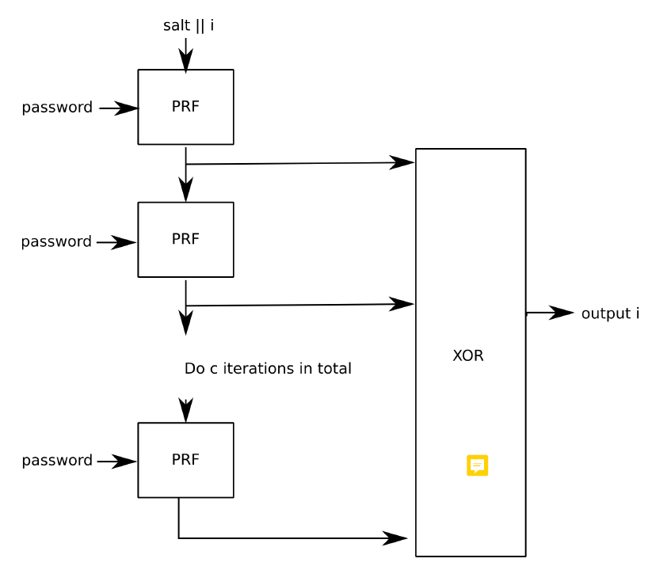

# Passwords

## Password hashing
### Key derivation function KDF
Fonction qui prend en input quelque chose qui a de l'aléatoire, et qui donne en output une clé cryptographique forte

### Attaques
- Dictionnaire
- ASIC (application specific integrated circuit = hardware optimisé pour)
- GPU
  - Mitigation: coût en mémoire

### PBKDF2

- PRF pseudo random function, par exemple HMAC
- Si la taille de sortie souhaitée est plus grande que la sortie de PRF, on fait plusieurs fois en incrémentant i
- Nombre d'itérations
  - 310'000 pour du hashing fait sur le serveur
  - 10'000'000 pour des clés critiques

### Argon2

- Degré de parallélisme
- Mémoire
- Temps d'exécution