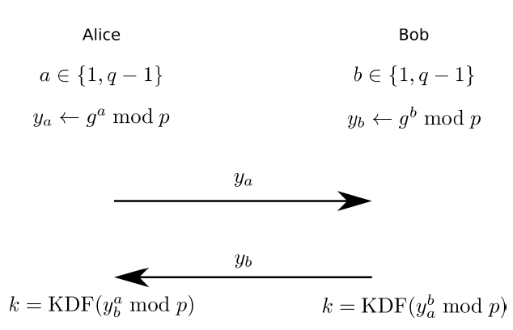

# Crypto asymétrique
## Diffie-Hellman
### Problème difficile
Logarithme discret
### Générer les paramètres publics
- Choisir deux nombres premiers p et q qui respectent p = cq + 1
  - Cette relation permet l'existence d'un élément d'ordre q, puisque comme ça l'ordre du groupe p-1 est un multiple de q
  - Le fait que q soit premier empêche certaines attaques
- Trouver g, un élément d'ordre q du groupe multiplicatif &Zopf;p* 
### Protocole

- KDF : key derivation function
## El Gamal
Chiffrement non déterministe
### Problème difficile
Logarithme discret
### Clés
- Clé privée : a appartient à &Zopf;q
- Clé publique : A = ga mod p
### Chiffrement
- Tirer k appartient à &Zopf;q uniformément au hasard
- (u, v) = (gk mod p, MAk mod p)
## Signatures DSA
