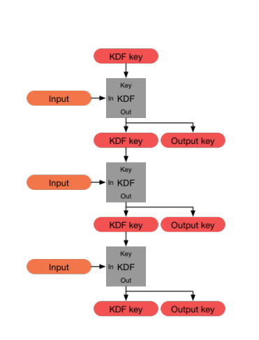
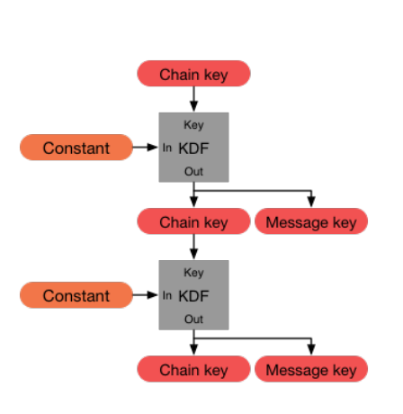
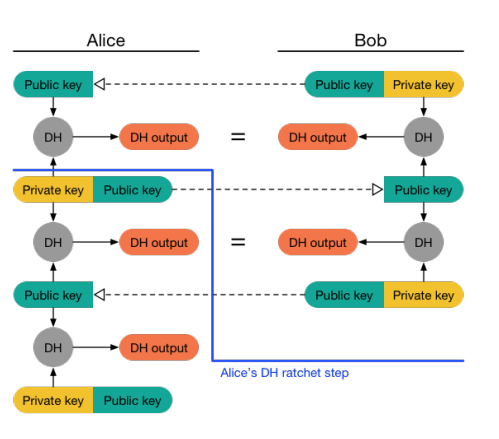
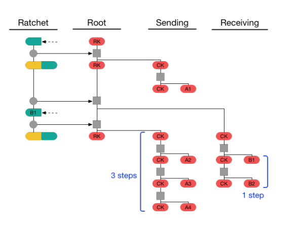

## Définitions
- Short-lived key
  - Chiffre une session
- Long-lived key
  - Typiquement ne change pas
- Perfect forward secrecy
  - Même si dans le futur une long-lived key est compromise, les sessions passées ne sont pas compromises, même si l'adversaire a enregistré les messages
  - Faisable avec Diffie-Hellman : on obtient une short-lived key avec un DH où les messages sont authentifiés avec la long-lived key
- Deniable authentication
  - Pendant la session : les messages sont authentifiés
  - Après la session : n'importe qui peut forger un message qui semble venir d'un des participants

## Signal

### KDF Ratchet

### Symmetric-key Ratchet

### DH Ratchet

### Double ratchet algorithm

